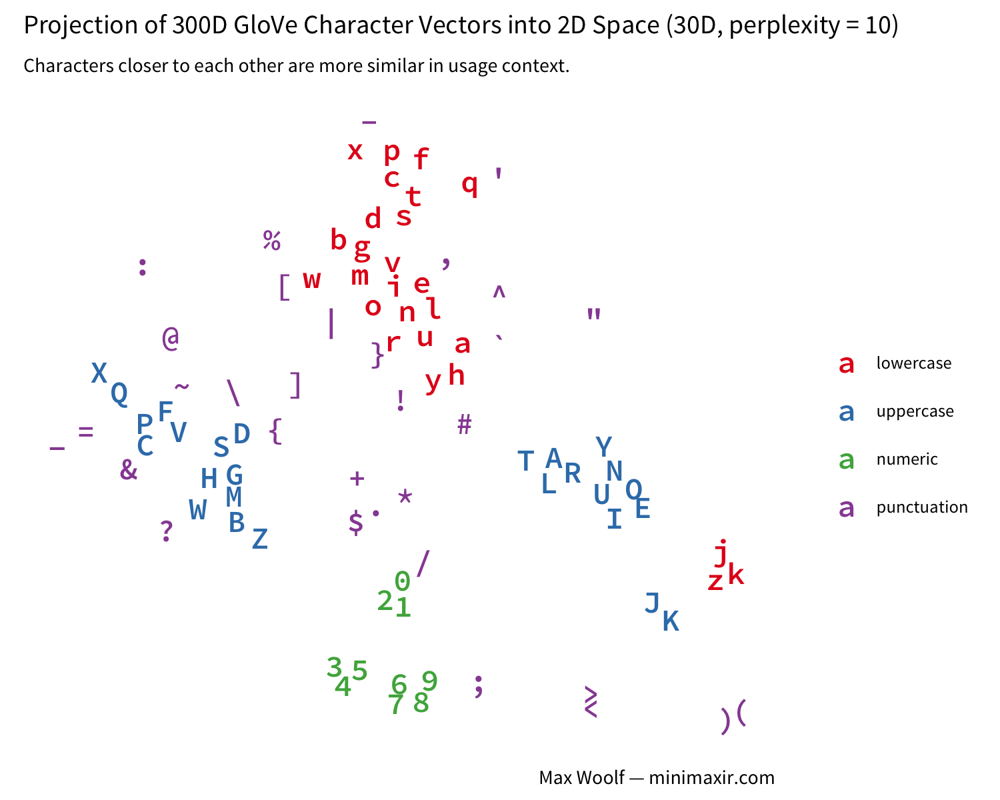
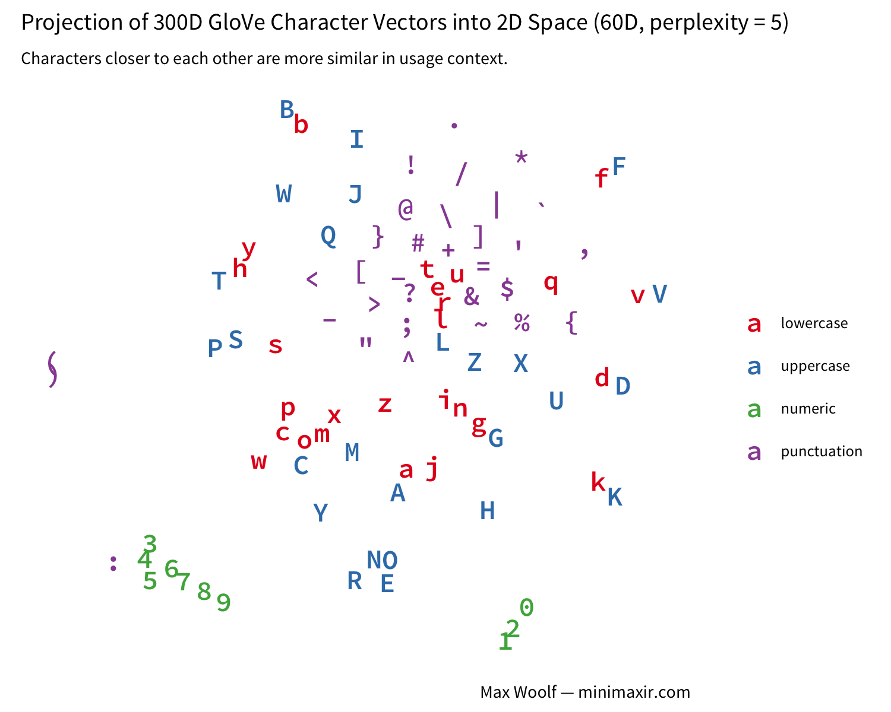

This R Notebook is the complement to my blog post [Pretrained Character Embeddings for Deep Learning and Automatic Text Generation](http://minimaxir.com/2017/04/char-embeddings/).

This notebook is licensed under the MIT License. If you use the code or data visualization designs contained within this notebook, it would be greatly appreciated if proper attribution is given back to this notebook and/or myself. Thanks! :)

```{r}
source("Rstart.R")
library(tsne)
```

# Visualize GloVe Vectors

```{r}
df <- read_delim("glove.840B.300d-char.txt", col_names = F, delim=" ", quote = "—")
df[,1:6]
```

Assign colors by character type (warning: jank implementation for determining character type)

```{r}
type <- ifelse(df$X1 %in% letters, "lowercase",
          ifelse(df$X1 %in% LETTERS, "uppercase",
            ifelse(df$X1 %in% c(0:9), "numeric", "punctuation")))

type <- factor(type, levels=c("lowercase", "uppercase", "numeric", "punctuation"))
type
```


```{r}
perplexity = 7
initial_dims = 16
max_iter = 5000

set.seed(123)
df_reduce <- tsne(df %>% select(X2:X301) %>% data.matrix(), perplexity = perplexity,
                  initial_dims = initial_dims, max_iter = max_iter)

df_reduce <- data.frame(char = df$X1, type = type, df_reduce) %>%
                tbl_df() %>%
                mutate(char = as.character(char))
df_reduce
```

```{r}
plot <- ggplot(df_reduce, aes(x=X1, y=X2, label=char, color = type)) +
          geom_text(family="Source Code Pro Semibold") +
          theme_void(base_family = "Source Sans Pro", base_size=8) +
          scale_color_brewer(palette="Set1") + 
          labs(title = "Projection of 300D GloVe Character Vectors into 2D Space (16D, perplexity = 7)",
               subtitle = "Characters closer to each other are more similar in usage context.",
               color = '') +
          theme(plot.margin = unit(c(0.2,0.2,0.2,0.2),"cm"),
                plot.subtitle = element_text(family="Open Sans Condensed Bold", size=8, color="#666666"))

max_save(plot, "char-tsne", w=5, h=4, "Stanford NLP")
```


```{r}
perplexity = 5
initial_dims = 70
max_iter = 5000

set.seed(123)
df_reduce <- tsne(df %>% select(X2:X301) %>% data.matrix(), perplexity = perplexity,
                  initial_dims = initial_dims, max_iter = max_iter)

df_reduce <- data.frame(char = df$X1, type = type, df_reduce) %>%
                tbl_df() %>%
                mutate(char = as.character(char))

plot <- ggplot(df_reduce, aes(x=X1, y=X2, label=char, color = type)) +
          geom_text(family="Source Code Pro Semibold") +
          theme_void(base_family = "Source Sans Pro", base_size=8) +
          scale_color_brewer(palette="Set1") + 
          labs(title = "Projection of 300D GloVe Character Vectors into 2D Space (70D, perplexity = 5)",
               subtitle = "Characters closer to each other are more similar in usage context.",
               color = '') +
          theme(plot.margin = unit(c(0.2,0.2,0.2,0.2),"cm"),
                plot.subtitle = element_text(family="Open Sans Condensed Bold", size=8, color="#666666"))

max_save(plot, "char-tsne-2", w=5, h=4, "Stanford NLP")
```



# Visualize Embedded Magic Characters

```{r}
df_embed <- read_delim("char-embeddings.txt", col_names = F, delim=" ", quote = "—")
df_embed <- na.omit(df_embed)   # removes space and newline since will not parse
df_embed[,1:6]
```

```{r}
type_embed <- ifelse(df_embed$X1 %in% letters, "lowercase",
                ifelse(df_embed$X1 %in% LETTERS, "uppercase",
                 ifelse(df_embed$X1 %in% c(0:9), "numeric", "punctuation")))

type_embed <- factor(type_embed, levels=c("lowercase", "uppercase", "numeric", "punctuation"))
```

```{r}
perplexity = 10
initial_dims = 30
max_iter = 5000

set.seed(123)
df_reduce <- tsne(df_embed %>% select(X2:X301) %>% data.matrix(), perplexity = perplexity,
                  initial_dims = initial_dims, max_iter = max_iter)

df_reduce <- data.frame(char = df_embed$X1, type = type_embed, df_reduce) %>%
                tbl_df() %>%
                mutate(char = as.character(char))

plot <- ggplot(df_reduce, aes(x=X1, y=X2, label=char, color = type)) +
          geom_text(family="Source Code Pro Semibold") +
          theme_void(base_family = "Source Sans Pro", base_size=8) +
          scale_color_brewer(palette="Set1") + 
          labs(title = "Projection of 300D Magic Card Character Vectors into 2D Space (30D, perplexity = 10)",
               subtitle = "Characters closer to each other are more similar in usage context.",
               color = '') +
          theme(plot.margin = unit(c(0.2,0.2,0.2,0.2),"cm"),
                plot.subtitle = element_text(family="Open Sans Condensed Bold", size=8, color="#666666"))

max_save(plot, "char-tsne-embed", w=5, h=4, "Keras Logging")
```


# Training Perfomance

```{r}
batches_per_epoch = 7850

df_train <- read_csv("log.csv") %>% filter(iteration <= 20) %>%
              mutate(cumbatch = (iteration-1) * batches_per_epoch + batch)
df_train %>% head(200)
```

```{r}
#df_train_reshape <- df_train %>% gather(key = loss_type, value = loss, batch_loss, epoch_loss) %>%
#                      mutate(loss_type = factor(loss_type))
#df_train_reshape %>% head(100)
```


```{r}
plot <- ggplot(df_train, aes(x=cumbatch, y=batch_loss, color=factor(iteration))) +
          geom_line(size=0.1) +
          scale_y_sqrt(breaks=c(0, 0.25, 0.5, 1, 2, 4)) +
          scale_x_continuous(breaks = seq(0, max(df_train$cumbatch)+batches_per_epoch, by=batches_per_epoch), labels = c(0:20)) +
          fte_theme() +
          theme(panel.grid.major = element_line(size=0.1)) +
    labs(title = "Batch Loss Over Time While Training Magic Card Generator",
          x = "# Epoch",
          y = "Batch Loss (128 Samples per Batch)")

max_save(plot, "batch-losses", "Keras Logging")
```


```{r}
plot <- ggplot(df_train, aes(x=cumbatch, y=epoch_loss, color=factor(iteration))) +
          geom_line(size=0.5) +
          scale_y_sqrt(breaks=c(0, 0.25, 0.5, 1, 2, 4)) +
          scale_x_continuous(breaks = seq(0, max(df_train$cumbatch)+batches_per_epoch, by=batches_per_epoch), labels = c(0:20)) +
          fte_theme() +
          theme(panel.grid.major = element_line(size=0.1)) +
    labs(title = "Epoch Loss Over Time While Training Magic Card Generator",
          x = "# Epoch",
          y = "Epoch Loss (Average Batch Loss During Epoch)")

max_save(plot, "epoch-losses", "Keras Logging")
```


# LICENSE

The MIT License (MIT)

Copyright (c) 2017 Max Woolf

Permission is hereby granted, free of charge, to any person obtaining a copy of this software and associated documentation files (the “Software”), to deal in the Software without restriction, including without limitation the rights to use, copy, modify, merge, publish, distribute, sublicense, and/or sell copies of the Software, and to permit persons to whom the Software is furnished to do so, subject to the following conditions:

The above copyright notice and this permission notice shall be included in all copies or substantial portions of the Software.

THE SOFTWARE IS PROVIDED “AS IS”, WITHOUT WARRANTY OF ANY KIND, EXPRESS OR IMPLIED, INCLUDING BUT NOT LIMITED TO THE WARRANTIES OF MERCHANTABILITY, FITNESS FOR A PARTICULAR PURPOSE AND NONINFRINGEMENT. IN NO EVENT SHALL THE AUTHORS OR COPYRIGHT HOLDERS BE LIABLE FOR ANY CLAIM, DAMAGES OR OTHER LIABILITY, WHETHER IN AN ACTION OF CONTRACT, TORT OR OTHERWISE, ARISING FROM, OUT OF OR IN CONNECTION WITH THE SOFTWARE OR THE USE OR OTHER DEALINGS IN THE SOFTWARE.